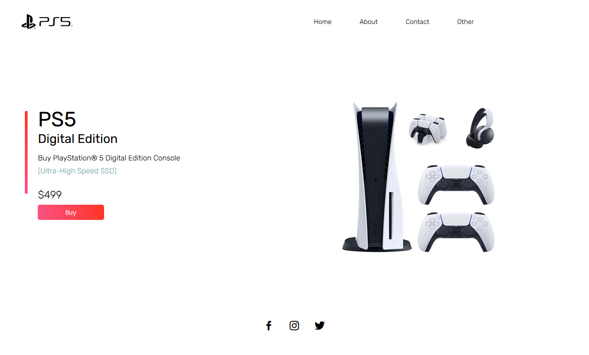

# PS5 Store - Responsive Website



Welcome to the PS5 Store repository! This project is a fully responsive e-commerce website dedicated to showcasing and selling PlayStation 5 consoles, games, and accessories. Designed to provide an exceptional user experience across all devices, our site ensures smooth navigation and a visually appealing interface.

## Features

- **Responsive Design:** Optimized for all screen sizes, ensuring a seamless experience on desktops, tablets, and mobile devices.
- **Dynamic Content:** Includes sections for product listings, featured items, customer reviews, and more.
- **Interactive Elements:** User-friendly navigation with dropdown menus, sliders, and modals.
- **Search Functionality:** Advanced search options to filter products based on categories, price, and popularity.
- **Shopping Cart:** Easy-to-use shopping cart functionality for a smooth checkout process.
- **Modern UI/UX:** Clean, professional design with attention to detail for a modern look and feel.
- **Cross-Browser Compatibility:** Works flawlessly across different web browsers.

## Technologies Used

- **HTML5:** For the structure and layout of the website.
- **CSS3:** For styling, animations, and responsive design.
- **JavaScript:** For interactivity and dynamic content manipulation.

## Installation

1. Clone the repository:
   ```bash
   git clone https://github.com/your-username/ps5-store.git
   ```

2. Navigate to the project directory: `cd PS5-Store---Responsive-Website`

3. Open `index.html` in your preferred web browser to view the website.

## Contributing

We welcome contributions! Please fork the repository and submit a pull request with your improvements or bug fixes.